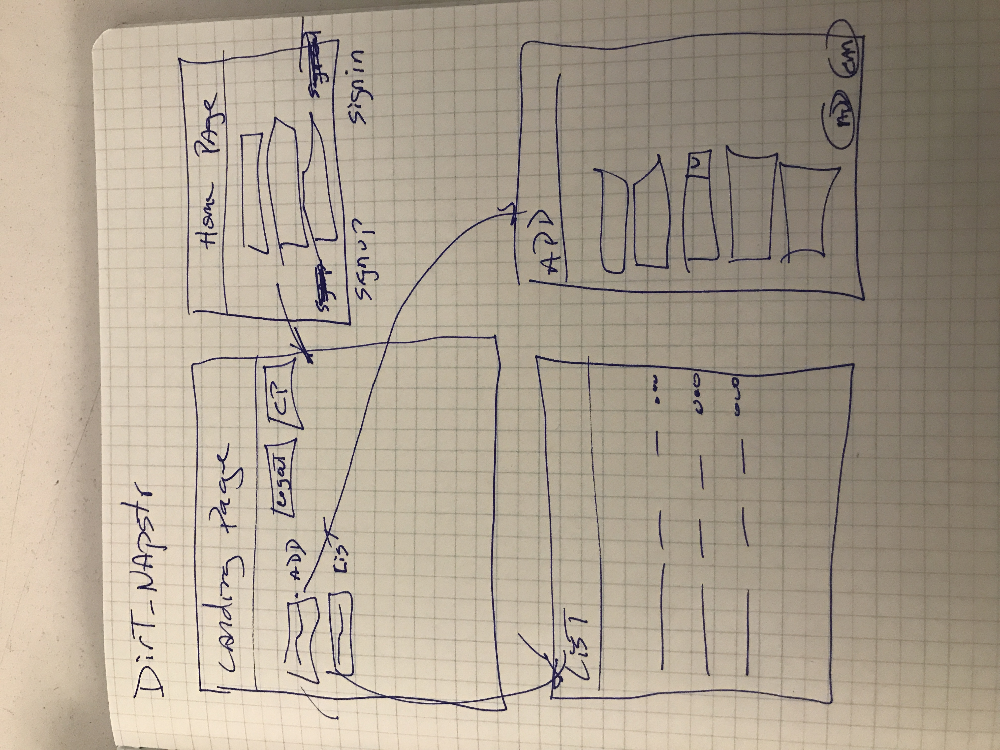

# dirt-napstr Client - Capstone

## Description

My capstone project was to build a gravesite tracker appliction.  A user must
be signed in before they can create/view/modify/delete their entries.

## Project Links

#### Back-End Deplpyed
[ProjectApiDeployed](https://octater-dirt-napstr-api.herokuapp.com/)
#### Back-End Repo
[ProjectApiRepo](https://github.com/octater/dirt-napstr-api)

#### Front-End Deployed
[CapstoneClientDeployed](https://octater.github.io/dirt-napstr-client/)
#### Front-End Repo
[CapsonteClientRepo](https://github.com/octater/dirt-napstr-client)

## APP Screenshot

## Wireframe

## User Stories

1. As a user, I want to sign up, so that I can create gravesites.
2. As a user, I want to sign in, so that I can create gravesites.
3. As a user, I want to change a password so that I can protect my identity.
4. As a user, I want to sign out, so that I can safely log out and no one can see my gravesites.
5. As a user, I want to create a gravesite so I can visit later.
6. As a user, I want to update existing gravesite so that I can modify them.
7. As a user, I want to delete a gravesite if it is no longer needed.
8. As a user, I want to be able to view all my gravesite records.

## Technologies

-   HTML
-   CSS
-   JavaScript
-   Bootstrap
-   Ajax
-   Handlebars
-   Heruko
-   Ruby/Rails
-   Postgres

## General Approach

As with all the previous projects, I first created the wireframe, user stories,
and ERD. I decided early to use Postgres database and not MongoDB (nothing
against MongoDB, but I felt this was better suited for a sql database).  From
the ERD, I proceeded to get the basic backend tables generated.

Working with it wireframe and user stories, I then started to get a working
CRUD frontend app ready.  I started with the user functions then proceeded to
the remains entries.

Lastly, I tried to beautify the app.  This turned out to be more work than
anticipated.  I wanted to use handlebars, a date picker, and a dropdown this
time.

## Unsolved Problems or Major Hurdles

No unsolved or known probles.  The only major hurdle was trying to remember
rails after working with express.

## Install Instructions / Major Hurdles

No special install instructions.

## [License](LICENSE)

1.  All content is licensed under a CC­BY­NC­SA 4.0 license.
1.  All software code is licensed under GNU GPLv3. For commercial use or
    alternative licensing, please contact legal@ga.co.
