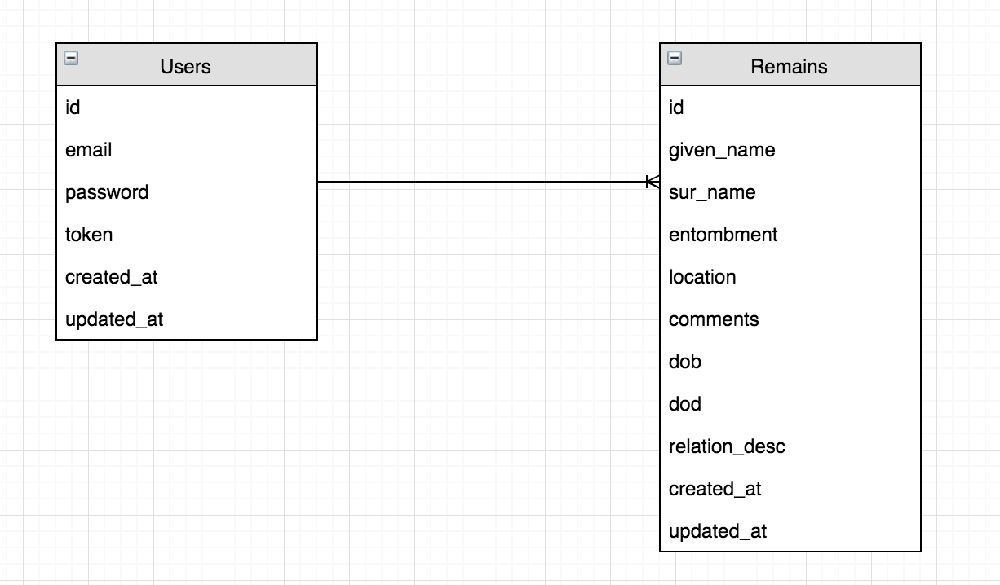

# dirt-napstr Client - Capstone

## Description

More to come

## Project Links

#### Back-End Deplpyed
[ProjectApiDeployed]()
#### Back-End Repo
[ProjectApiRepo]()

#### Front-End Deployed
[ProjectClientDeployed]()
#### Front-End Repo
[ProjectClientRepo]()

## ERD

## Wireframe

! [Wireframe](images/wireframe.jpg)

## User Stories

1. As a user, I want to sign up, so that I can create gravesites.
2. As a user, I want to sign in, so that I can create gravesites.
3. As a user, I want to change a password so that I can protect my identity.
4. As a user, I want to sign out, so that I can safely log out and no one can see my gravesites.
5. As a user, I want to create a gravesite so I can visit later.
6. As a user, I want to update existing gravesite so that I can modify them.
7. As a user, I want to delete a gravesite if it is no longer needed.
8. As a user, I want to be able to view all my gravesite records.

## Technologies

-   HTML
-   CSS
-   JavaScript
-   Bootstrap
-   Ajax
-   Handlebars
-   Heruko
-   More to come

## General Approach

More to come

## Unsolved Problems or Major Hurdles

More to come

## Install Instructions

N/A

## [License](LICENSE)

1.  All content is licensed under a CC­BY­NC­SA 4.0 license.
1.  All software code is licensed under GNU GPLv3. For commercial use or
    alternative licensing, please contact legal@ga.co.
